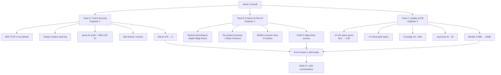

# SiteSync PM → Pilot-Ready (Phase 1)

## Context

Take this codebase to enterprise quality so a real GC can use it. Phase 1 only — get a paid pilot signed at one ENR Top 400 mid-size GC ($50M–$1B revenue) within **4–6 weeks** with a 3-engineer team.

**Strategic shape (locked):**
- Beachhead: ENR Top 400 mid-size GC, not Fortune 500. Lower trust bar, faster cycle.
- Team: 3 engineers, three parallel tracks.
- Monetization: per-project flat fee ($5k–25k/yr per licensed project). Stripe Connect deferred to Phase 3.

**Codebase state (verified against this tree):**
- Strong: real Claude AI, Procore + Sage 300 integrations, multi-tenant org/RLS, Capacitor PWA, AIA G702/G703 PDFs, WH-347 math, ~1,416 unit tests passing (`.quality-floor.json:testCount`), all 10 CI checks green on main.
- Gaps: MFA infra exists in `supabase/config.toml:285` (`[auth.mfa.totp]`) but `enroll_enabled = false` at line 287. Audit log lacks tamper-evident hash chain (6 audit migrations, none add `previous_hash`). 12 Playwright specs in `e2e/` but `e2ePassRate: 0` in `.quality-floor.json` — they don't run in CI. Coverage 43.2%. Bundle 3.4MB. ESLint errors floor 478. `src/lib/demoData.ts` intentionally emptied. No customer docs.
- Out of scope (Phase 2+): SOC 2, pen test, SAML SSO, whitelabel, load testing.

## Track structure

## Track A — Trust & security floor (Engineer 1)

Minimum a mid-size GC's IT will sanity-check.

1. **MFA TOTP on by default.** Flip `enroll_enabled = true` in `supabase/config.toml:287` (and `verify_enabled` line 288). Build `src/components/auth/MfaEnrollment.tsx` (sibling of existing `PermissionGate.tsx`, `ProtectedRoute.tsx`); wire into `src/pages/UserProfile.tsx`. Soft-force for `owner`/`admin`/`project_manager` (warning banner first 7 days, hard block thereafter) via `src/hooks/useAuth.ts`. ~5 days.
2. **Tamper-evident audit log.** New migration adds `previous_hash` + `entry_hash` columns to `audit_log` (touches `supabase/migrations/00002_audit_trail.sql` lineage). Hash-chain via Postgres `BEFORE INSERT` trigger so app code can't bypass. New `supabase/functions/verify-audit-chain/` runs nightly + alerts on break. Update `src/lib/auditLogger.ts` to read but not write the hashes. ~5 days.
3. **Lock down `parse-ifc`.** `supabase/functions/parse-ifc/index.ts` relies only on JWT verify, no in-handler authz. Add `authenticateRequest` + project-permission check. Audit other edge functions (`agent-runner`, `query-brain`, etc.) for same gap. ~1 day.
4. **Sanitize Wiki HTML.** `src/pages/Wiki.tsx:512` uses `dangerouslySetInnerHTML`. Replace with `react-markdown` + `rehype-sanitize`. ~1 day.
5. **Idle session timeout + lockout.** 30-min idle (configurable per org), 5 failed attempts → 15-min cooldown. Wire through `useAuth.ts`. ~3 days.
6. **ESLint errors 478 → 0.** Most auto-fixable via `eslint --fix`. Ratchet weekly in `.quality-floor.json`. ~5 days bleeding through phase.

## Track B — Product polish & pilot UX (Engineer 2)

What an actual GC PM cares about: the demo, onboarding, "wow."

1. **Demo project flow.** `src/lib/demoData.ts` is currently 3 lines of comments only. Restore with curated "Maple Ridge Mixed-Use" sample: 50 RFIs, 20 submittals, 10 COs, 100 punch items, drawings, 30 daily logs, full schedule. On org creation, seed one read-only demo + one empty real project. "Reset Demo" button in `src/pages/admin/ProjectSettings.tsx`. ~7 days.
2. **Per-project licensing & billing.** New `src/services/billing/projectLicenses.ts` + `project_licenses` migration. Org admin purchases licenses ($5k–25k/yr each), assigns to project rows, sees expiration, expired projects auto-archive read-only. Stripe Checkout (one-time + annual recurring per project) via existing `supabase/functions/billing-*` and `stripe-webhook`. ~7 days.
3. **Customer docs site.** Mintlify at `docs.sitesync.app`. 15+ articles: getting started, RFIs, submittals, COs, pay apps, daily logs, drawings/markup, mobile/PWA install, Procore integration, Sage integration, security overview, troubleshooting, FAQ, glossary, release notes. ~10 days.
4. **Polish 5 daily-driver screens.** Dashboard, RFI list, Submittals list, Daily Log, Punch List Plan View — empty/loading/error states all at retail quality. ~5 days.

## Track C — Quality bar & E2E (Engineer 3)

Safety net against regressions to a paying customer.

1. **Get all 12 Playwright specs in `e2e/` green** (`accessibility`, `command-palette`, `dashboard`, `demo-flow`, `export`, `mobile`, `navigation`, `offline`, `responsive`, `rfi-workflow`, `search`, `smoke`). Triage, fix, delete vestigial. Raise `e2ePassRate` floor in `.quality-floor.json` from 0 → 0.95+. Gate merges on it. ~5 days.
2. **Add 4 critical-path specs:** pay-app submit-and-approve, CO draft-through-approval, RFI submit-respond-close, daily-log create-submit-PDF. ~5 days.
3. **Coverage 43% → 60%** on statements/lines/functions in `.quality-floor.json`. Focus `src/services/`, `src/hooks/mutations/`, `src/machines/`. Update ratchet. ~7 days.
4. **`anyCount` 41 → 25.** Replace `as any` with `fromTable<T>()` per existing `type-safe-supabase` skill. ~3 days.
5. **Bundle ≤2MB initial chunk** (currently 3,421KB). In `vite.config.ts` code-split `vendor-three`, `vendor-ifc`, `vendor-openseadragon`, `vendor-fabric` so each loads only on its consuming route (`/bim`, `/drawings`, `/whiteboard`). ~3 days.

## Non-engineering parallel work

- Pilot contract template via SaaS lawyer (~$3k flat) — week 1.
- 3 GC outreach calls/week from week 1.
- Status page at `status.sitesync.app` (Better Stack free tier) — 2 hours.
- Public security overview at `sitesync.app/security` — 1 day, sourced from `docs/SECURITY_AUDIT_2026_04_24.md`.

## Week-by-week

| Week | Eng 1 (Trust) | Eng 2 (Product) | Eng 3 (Quality) |
|---|---|---|---|
| **1** | MFA enrollment UI + soft-force. Lock down `parse-ifc`. Wiki XSS fix. | Restore `demoData.ts` Maple Ridge fixture. Mintlify site stood up. | Triage 12 Playwright specs; raise `e2ePassRate` floor ≥0.9. |
| **2** | Audit log: schema + Postgres trigger + `verify-audit-chain` cron. | Demo seeded on org create + Reset button. Polish 5 daily-driver screens. | +4 critical-path E2E specs. Coverage 43→55%. |
| **3** | Idle timeout + failed-login lockout. | `project_licenses` table + Stripe Checkout + assignment UI. Status page live. | Coverage 55→60%. `anyCount` 41→25. Public security page live. |
| **4** | ESLint errors 478→0. Edge-function rate limits via Upstash Redis. | 15 docs articles published. Pilot contract signed off. First GC calls scheduled. | Bundle 3.4MB→≤2MB via per-route splits. Final regression sweep. |

**End of week 4 = pilot-ready.** Pilot conversations begin week 5.

## Verification checklist (Phase 1 done = all green)

- [ ] Fresh-org sign-up prompts MFA enrollment; QR scan completes; org owner appears in `audit_log` with chained `previous_hash`.
- [ ] `npx playwright test` runs in CI; 16+ specs green; `e2ePassRate ≥ 0.95` enforced in `.quality-floor.json`.
- [ ] All routes render <2s, no console errors, in production build.
- [ ] `parse-ifc` returns 403 for a JWT scoped to a different project.
- [ ] Sign-up lands in pre-seeded Maple Ridge demo; "Reset Demo" restores state.
- [ ] `docs.sitesync.app` live, 15 articles indexed, ≤3 clicks to "create change order."
- [ ] `bundleSizeKB ≤ 2048`, `coveragePercent ≥ 60`, `eslintErrors = 0`, `anyCount ≤ 25` in `.quality-floor.json`.
- [ ] One signed pilot contract.

## Phases 2–4 (summary; full plan when Phase 1 ships)

- **Phase 2 (months 2–5): Procurement-ready.** SOC 2 Type I, pen test, SAML SSO, SCIM, lawyer-drafted DPA/MSA, 70% coverage, 1MB bundle, status page, immutable audit shipping, edge rate limits, Procore bidirectional, whitelabel. Vendor budget ~$60–90k.
- **Phase 3 (months 5–9): Sales-ready.** SOC 2 Type II, reference customers, sales collateral, public API, Stripe Connect rollout, customer-success function, per-region residency.
- **Phase 4 (year 2): Scale-ready.** HIPAA BAA, ISO 27001, FedRAMP path (with signed gov LOI), multi-region active-active, dedicated tenants for largest customers.

## Don't do these in Phase 1

1. Don't add a 13th half-finished integration. Procore + Sage to certified depth first.
2. Don't rewrite the AI features. Polish, don't reimagine — they're a moat.
3. Don't ship native iOS/Android. Capacitor PWA wrapper is enough through Phase 2.
4. Don't pursue FedRAMP. 12 months + ~$250k. Only with a signed government LOI.
5. Don't enable Stripe Connect for sub payments. Phase 3 work.
6. Don't skip the lawyer. $5k now saves $50k of negotiation churn.
7. Don't ratchet quality floors to "max strict" overnight. Move them weekly.

## Open questions (surface in week 1, won't block kickoff)

1. Funding posture for Phase 2 vendors (~$60–90k months 2–5)?
2. Domain ownership of `sitesync.app`/`.com` for docs + status subdomains?
3. Stripe state — real Connect-enabled account or dev-mode keys?
4. Pilot price anchor — $5k, $15k, or $25k per project? Determines buyer persona.

## Files most affected (Phase 1)

`supabase/config.toml` (MFA flip lines 287–288), new migration for audit hash chain + `project_licenses`, `src/lib/auditLogger.ts`, `src/pages/auth/`, `src/pages/UserProfile.tsx`, new `src/components/auth/MfaEnrollment.tsx`, `supabase/functions/parse-ifc/index.ts`, new `supabase/functions/verify-audit-chain/`, `src/pages/Wiki.tsx:512`, `src/lib/demoData.ts`, `src/hooks/useAuth.ts`, `src/pages/admin/ProjectSettings.tsx`, `e2e/*.spec.ts`, `.quality-floor.json`, new `src/services/billing/projectLicenses.ts`, new Mintlify repo, `vite.config.ts` (per-route splits).
